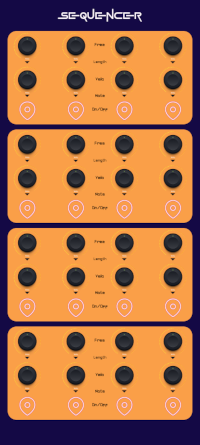
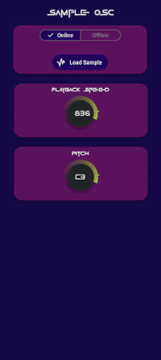
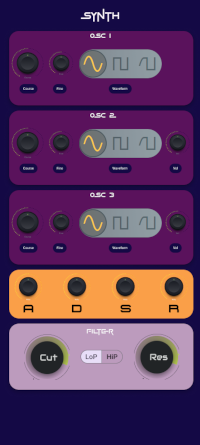
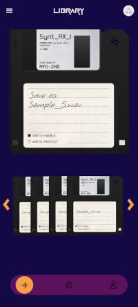
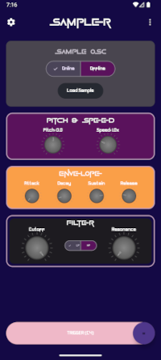
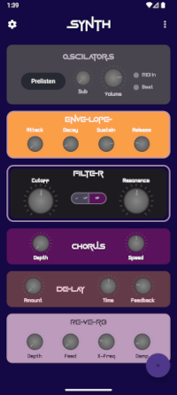
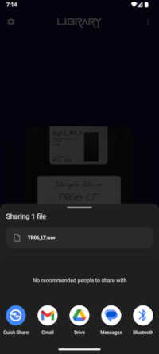

# Synt_AX1
### V0.8.2 Public Beta

### Syntax Institut - Batch 26 - Modul 4 - Android Final Project by Dirk Hammacher

## Author

- [@BBB-Audio](https://github.com/BBB-Audio/BBB-Audio)

## Features

- 🎛️ Lightweight Synth Engine – Built with Pure Data (libpd) powered Synth Engine
- 🎹 Intuitive 16-Step Sequencer - Dynamic parameter control (Note, Length, Velocity & 1 mappable Parameter)
- 💾 Patch Management – Build your personal sound library with local storage
- 📤 Export Processing – Export processed Samples for use in DAWs and Music Software
- 🌐 Share & Discover Patches – Exchange sounds with a growing community of sound designers

## Design 

<details>
<summary><b>Figma Design</b></summary>






</details>

## Screenshots 

<details>
<summary><b>Actual Screenshots</b></summary>






</details>

## Getting Started

For a comprehensive guide on features, workflows, and troubleshooting, see the [Full Manual](docs/Manual.pdf).

# Architecture

The architecture of Synt_AX1 follows a pragmatic, modern Android approach, combining the **MVVM (Model-View-ViewModel)** pattern with principles from **Clean Architecture** and a **MVI (Model-View-Intent)**-based communication style for the UI layer.

<details>
<summary><b>🏛️ Architectural Overview</b></summary>

- **MVVM as the Foundation:** The app is clearly separated into Model (data and logic layers), View (Composable UI), and ViewModel (state holder and logic entry point).
- **Clean Architecture for Freesound Module:** For interactions with the external Freesound API, a strict layer separation is enforced to keep the core logic testable and framework-independent.
    - **Data Layer:** The `FreesoundRepository` encapsulates all network calls, data parsing, and exception handling.
    - **Domain Layer:** `UseCases` (`SearchSoundsUseCase`, `DownloadSoundUseCase`, etc.) contain specific business rules of the application (e.g., "a search query cannot be blank").
    - **Presentation Layer:** The `FreesoundViewModel` orchestrates the UseCases and translates the results into a `UiState` for the UI.
- **Classic MVVM for other Modules:** For direct control of the audio engine (Synth, Sampler), a simpler MVVM pattern is used where the ViewModel communicates directly with the `PdEngineManager` to minimize latency and improve development speed.

</details>

<details>
<summary><b>🌊 Data Flow & State Management (MVI)</b></summary>

- **Unidirectional Data Flow:** The state always flows down from the ViewModel to the UI, and events flow up from the UI to the ViewModel.
- **State (`UiState`):** Each ViewModel exposes a single `StateFlow<UiState>`. This is the *single source of truth* for the UI.
- **Events (`Event`):** The UI reports user interactions not by calling multiple specific functions, but by sending "Events" (e.g., `FreesoundEvent.Search`) to a single, central `onEvent` function in the ViewModel. This creates a clean, traceable, and testable loop.

</details>

<details>
<summary><b>⚠️ Robust Error Handling</b></summary>

- **Architecture:** The ViewModel uses `try-catch` blocks to catch exceptions thrown from the lower layers (UseCases, Repositories). This keeps the business logic clean of `Result` wrappers while still ensuring app stability.
- **State:** Technical errors (network, HTTP) and business logic errors (e.g., empty search) are mapped to a structured `ErrorState` object within the `UiState`.
- **UI:** The UI is "dumb" and simply reacts to this `ErrorState`. If the state is not null, it displays a detailed, user-friendly error dialog instead of crashing, ensuring a fault-tolerant and robust user experience.

</details>

<details>
<summary><b>🧩 Dependency Injection with Koin</b></summary>

- **Framework:** Koin is used project-wide to provide dependencies, promoting loose coupling and testability.
- **Modules:** `appModule` and `engineModule` define the "recipes" for constructing all necessary classes (ViewModels, UseCases, Repositories).
- **Benefits:** Increases the testability, maintainability, and scalability of the codebase.

</details>


## Setup

To enable the Freesound integration, you need to provide your personal API key. This is done securely via the `local.properties` file, which is ignored by version control and keeps your keys safe.

1.  **Locate or create `local.properties`**: This file should be in the root directory of the project (the same level as `gradle.properties` and `settings.gradle.kts`). If it doesn't exist, simply create a new file with that name.

2.  **Add your API Key**: Add the following line to your `local.properties` file, replacing `YOUR_KEY_HERE` with your actual key:

    ```properties
    freesound.api.key=YOUR_KEY_HERE
    ```

Get your personal API key [here](https://freesound.org/apiv2/apply/). It's free and easy to get.


### Quick Start

1. Launch the app
2. Select or downpload a sample via Freesound
3. Build your patch with the Sequencer, ADSR, and Filter
4. Save and share!

For advanced usage, refer to the [Full Manual](docs/Manual.pdf).


### Note on Build Output

<details>
<summary><b>⚠️ During the build process, you may encounter the following warning:</b></summary>   

⚠️ APK app-debug.apk is not compatible with 16 KB devices.  
Some libraries have LOAD segments not aligned at 16 KB boundaries:  
lib/arm64-v8a/libbob_tilde.so  
lib/arm64-v8a/libbonk_tilde.so  
...

**This is a known, non-critical warning.**   
It is related to the packaging of specific native libraries from the Pure Data (`libpd`) framework and **does not affect the functionality, performance, or stability of the application on the vast majority of devices.**


*   **Cause:** Certain pre-compiled Pure Data externals are not optimized for a very specific memory alignment requirement (16 KB boundaries) that is only relevant for a small subset of older or highly specific Android devices.
*   **Impact:** The application builds successfully and runs correctly on all modern Android phones, tablets, and emulators. The warning can be safely ignored for development and production.
*   **Context:** This is a common artifact when embedding audio synthesis libraries like `libpd` and is documented in related community discussions.
</details>


## Roadmap

- [X] PD-based sample-accurate clock synchronization
- [X] Community Sample exchange platform
- [X] Advanced effects processing chain
- [ ] Multi-oscillator synthesis expansion
- [ ] Improve Synth Oscilators
- [ ] finalize Sampler & SampleScrubber
- [ ] Community Patch exchange platform

## Acknowledgements

- [Pure Data](https://puredata.info/)
- [pd Documentation](https://puredata.info/docs)
- [libpd](https://libpd.cc/)
- [Freesound](https://freesound.org/)
- [Lottie](https://airbnb.design/lottie/)


## License

[](https://opensource.org/licenses/Apache-2.0)

Copyright (c) [2025] [@BBB-Audio](https://github.com/BBB-Audio/BBB-Audio)
